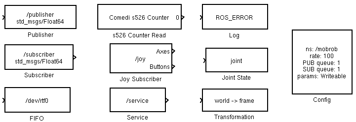

Blocks
======

Following blocks are available to connect with ROS.

* **Publisher/Subscriber** to read/write `topics <http://wiki.ros.org/Topics>`_.

  Available message types:

  * std_msg/Bool
  * std_msg/Int32
  * std_msg/Float64
  * std_msg/Float64MultiArray
  * std_msg/Time
  * geometry_msgs/Point
  * geometry_msgs/PointStamped
  * geometry_msgs/Twist
  * geometry_msgs/TwistStamped
  * geometry_msgs/Pose2D

* **Service** to make a `service call <http://wiki.ros.org/Services>`_ with request and reply message of type ``std_msg/Empty``.
* **Transformation publisher** to publish `tf messages <http://wiki.ros.org/tf>`_.
* **Joint state publisher** to publish `joints <http://wiki.ros.org/joint_state_publisher>`_.
* **Joystick subscriber** to read from `joy node <http://wiki.ros.org/joy>`_.
* **Config** to configure following parameters of the ROS node:

  * Rate (default: 100 ms)
  * Namespace (default: none)
  * Publisher queue size (default: 10)
  * Subscriber queue size (default: 10)
  * If parameters should be exposed to parameter server and can be changed with ``/NODE/set_parameters`` (default: read only).

* **Logger** to send a log message triggert by a raising edge.

There are additional blocks to read a Sensoray s526 counter and write to a RTAI-FIFO.
All other blocks are taken from `RTAI-Lab <https://www.rtai.org/?About_RTAI-Lab>`_.
