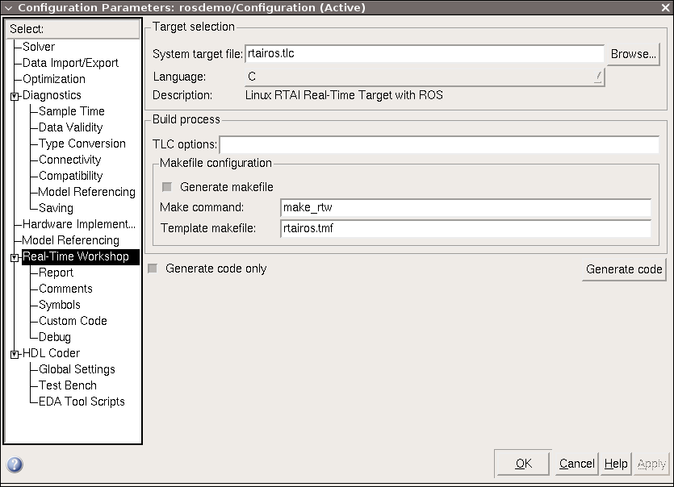

.. _Usage:

Usage
=====

The usage of RTAI-ROS will be explained using the example  ``examples/rosdemo.mdl``.

.. figure:: _static/rosdemo.png
   :align: center
   :width: 800px

Generate code
-------------

1. Open your Simulink model, in our case ``rosdemo.mdl``.
2. Open the configuration dialog **Simulation → Configuration Parameters → Real-Time Workshop** and select ``rtairos.tlc`` as *System target file*. If you don't want to compile the code, select also *Generate code only*.
3. Click on *Generate code*. This creates the subdirectory ``rosdemo_rtairos`` in your current directory containig the generated source code.
4. Copy the directory ``rosdemo_rtairos`` to your RTAI Linux system.

Build
-----

1. Change to the source directory ``rosdemo_rtairos``. If you generated your code on a Windows system create a symbolic link to the make file::

     ln -s rosdemo.mk Makefile

2. Build the program::

     make

Run
---

1. Start the ROS master::

     roscore &

2. Set the ``ROS_MASTER_URI`` environment variable::

     export ROS_MASTER_URI=http://localhost:11311

3. Start the demo::

     ../rosdemo

Connect with ROS
----------------

Now you can connect to the running program using ROS, e.g:

* Show all registered topics and services::

    rosnode info /rosdemo

* Read from topic::

    rostopic echo /demo/uy

* Write to topic::

    rostopic pub -1 /demo/v std_msgs/Float64 2

* Read all parameters of the model from parameter server::

    rosparam get /rosdemo

  This will give you the following output::

    Config: {P1: 10.0, P3: 1.0, P4: 1.0, P5: 3.0}
    Constant: {Value: 1.0}
    Environment_Controller:
    Switch_Control: {Value: 0.0}
    Environment_Controller1:
    Switch_Control: {Value: 0.0}
    Integrator: {InitialCondition: 0.0}
    Log: {P1: 2.0, P3: 0.0}
    Publisher: {P1: 4.0, P3: -1.0}
    Publisher1: {P1: 1.0, P3: -1.0}
    Publisher2: {P1: 5.0, P3: -1.0}
    Publisher3: {P1: 1.0, P3: -1.0}
    Publisher4: {P1: 1.0, P3: -1.0}
    Publisher5: {P1: 1.0, P3: -1.0}
    Publisher6: {P1: 2.0, P3: -1.0}
    Pulse_Generator: {Amplitude: 1.0, Period: 10000.0, PulseWidth: 5000.0}
    Repeating_Sequence:
    Look_Up_Table1:
    InputValues: [0.0, 2.0, 4.0, 6.0]
    Table: [0.0, 2.0, 2.0, 0.0]
    Service: {P2: -1.0}
    Service1: {P2: -1.0}
    Subscriber: {P1: 1.0, P3: 1.0, P4: -1.0, P5: 0.0}
    Subscriber1: {P1: 1.0, P3: 0.0, P4: -1.0, P5: 0.0}

* Change the parameters of the square wave signal::

    rosparam set /rosdemo/Pulse_Generator '{Amplitude: 0.5, Period: 5000, PulseWidth: 2500}'
    rosservice call /rosdemo/set_parameters

* Set source to trapezoidal signal::

    rosservice call /demo/trapezoid

Instead of using command line tools you can use `rqt <http://wiki.ros.org/rqt/>`_, check ``examples/rosdemo.perspective`` for a demo perspective.

.. figure:: _static/rosdemo-rqt.png
   :align: center
   :width: 600px

Special services
----------------

The ROS node provides up to three special services:

* ``/rosdemo/refresh_parameters`` to write model parameters to the parameter server. This can be avoided via config block.
* ``/rosdemo/set_parameters`` to write modified parameters on the parameter server to the model. This can be set via config block.
* ``/rosdemo/start`` to start the real-time process if the program was started with ``-w``.

Parameters
----------

There are various arguments for the program which can be shown by ::

  ../rosdemo -h

The generated program supports also `parameter mapping <http://wiki.ros.org/Remapping%20Arguments>`_ ::

  ../rosdemo name:=new_name

To run multiple programs on the same machine it is required to set the name of the host interface task (default ``IFTASK``) with ::

  ../rosdemo -n TASK2

to avoid conflicts.
The number of blocks useable on a machine is restricted by the number of registrable RTAI objects set during the installation of RTAI.
You can read this number from ``MAX_SLOTS`` in ``/proc/rtai/name``.
For the moment every block requires two RTAI objects, one for the shared memory and one for the semaphore.

